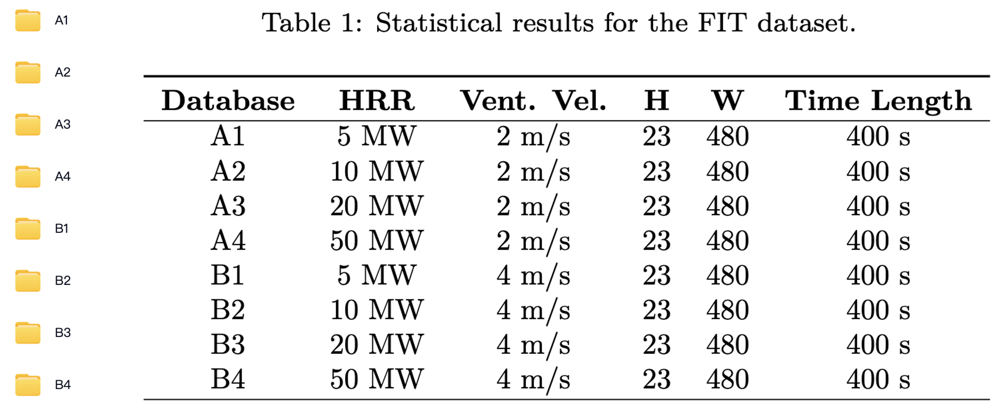

MUST-BN

## Dataset Link:

The dataset corresponds one-to-one as shown below. It can be accessed through the provided link to fully train our model.

link: https://pan.baidu.com/s/1dTtC-bJyngHc6tVit5I2aQ 

password: 7h5y 

#2025 12 21
基于 DeepONet (深度算子网络) 的航班延误预测系统的核心预处理模块。针对民航数据这种典型的高维、非线性、强随机复杂系统，我们构建了一套从“混沌原始数据”到“高信噪比特征张量”的核级预处理流水线。
通过精准应用 Pearson 相关分析 (R) 进行外科手术式的特征初筛，并利用 Box-Cox 变换 (Q) 彻底解决航空延误数据的长尾偏态问题，为后续 DeepONet 模型的极速收敛与高精度预测提供了“教科书级”的数据基石。
